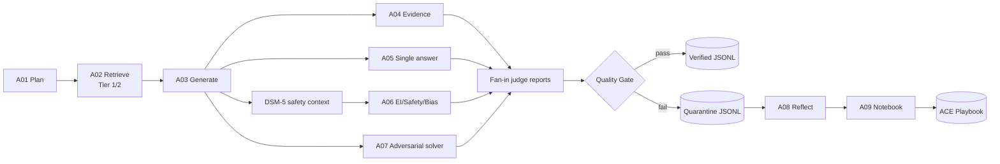

# Evidence-gated psychology MCQ pipeline

Pipeline sinh câu hỏi trắc nghiệm tâm lý có evidence gate. LangGraph điều phối
A01–A09: curriculum → retrieval → MCQ → evidence/single-answer/EI-safety judge
→ bounded regenerate on feedback → verified hoặc quarantine → ACE playbook và
judge failure memory.

Mỗi record verified bắt buộc có `evidence_refs` gồm các `chunk_id` đã retrieve:
easy=1–2, medium=1–4, hard=2–6. Câu hard phải tổng hợp các claim được hỗ trợ
trực tiếp từ ít nhất hai chunk khác nhau. Ở mọi độ khó, mọi chi tiết thực tế
trong stem/ví dụ phải được hỗ trợ bởi một chunk trong `evidence_refs`. Nếu muốn
quy dẫn trong câu hỏi, A03 dùng văn phong tự nhiên như “Theo quan điểm của
chuyên gia tâm lý, ...”, không bao giờ hiện `chunk_id` hay mã trích dẫn.
Pipeline không lưu `<think>` tự do. Trường `reasoning.steps` chỉ chứa audit steps
ngắn, có thể kiểm tra được, không phải chain-of-thought.



## EmoBench cho câu hỏi cảm xúc

Pipeline dùng EmoBench như **rubric cho agent A06**, không dùng sample EmoBench
làm nguồn kiến thức hay bằng chứng đáp án.

1. A01 gán blueprint `emobench` cho mọi item `emotion`:
   - `EU` (*Emotional Understanding*) khi câu hỏi yêu cầu nhận diện cảm xúc hoặc nguyên nhân cảm xúc.
   - `EA` (*Emotional Application*) khi câu hỏi yêu cầu chọn phản hồi/hành động phù hợp.
2. A03 nhận blueprint này để giữ đúng loại câu hỏi.
3. A06 trả một report có cấu trúc, chấm từng criterion `pass` hoặc `fail`.
4. Thiếu criterion, sai task EU/EA, hoặc có một criterion `fail` đều khiến A07
   quarantine item và gửi phản hồi cho lần generate lại.

### Rubric EU

EU dùng một category: `complex_emotions`, `emotional_cues`,
`personal_beliefs_experiences`, hoặc `perspective_taking`. A06 bắt buộc kiểm:

- `emotion_recognition`
- `emotion_cause_separation`
- `category_fit`
- `perspective_taking`

### Rubric EA

EA ghi rõ các chiều `relationship_type` (`personal`/`social`), `problem_owner`
(`self`/`others`) và `question_type` (`response`/`action`). A06 bắt buộc kiểm:

- `perspective_taking`
- `context_sensitive_response`
- `relationship_fit`
- `problem_owner_fit`
- `response_action_fit`

Ví dụ phần metadata/validation của một item cảm xúc đã verified:

```json
{
  "metadata": {
    "emobench": {
      "enabled": true,
      "task": "EA",
      "relationship_type": "personal",
      "problem_owner": "others",
      "question_type": "response"
    }
  },
  "validation": {
    "emobench_status": "pass"
  }
}
```

Các ví dụ trong `EmoBench/data/EU.jsonl` và `EmoBench/data/EA.jsonl` chỉ phù hợp
để regression-test judge hoặc đo chất lượng model judge theo category. Chúng
không được retrieve, prompt-inject, hay trích dẫn trong `evidence_refs`; evidence
của MCQ vẫn chỉ là các chunk Tier 1/2 từ MongoDB trong giới hạn difficulty.

## Requirements

- Python 3.12 and [uv](https://docs.astral.sh/uv/).
- MongoDB Tier 1 textbook collection and Tier 2 `mental` collection, each with
  a compatible vector index (`vector_index` by default).
- DSM-5 collection (default `DSM-5`) with the same vector index for clinical
  safety review.
- An OpenAI-compatible chat endpoint or a local endpoint at port `8000`.
- An embedding source: local `SentenceTransformer` or an OpenAI-compatible
  embedding endpoint.

## Setup

```bash
cd pipeline-craw-data
cp .env.example .env
uv sync
```

Edit `.env` with your MongoDB URI and model endpoint. `.env` is ignored by Git;
do not put secrets in `.env.example`.

## Run

### Model routing: Generator, Judge và Notebook insight tách riêng

| Vai trò | Agent sử dụng | Biến cấu hình | Fallback |
|---|---|---|---|
| Generator | A01 Curriculum Planner, A03 MCQ Generator | `OPENAI_BASE_URL`, `OPENAI_API_KEY`, `MODEL_NAME` | Không có; đây là model chính. |
| Judge | A04 Evidence, A05 Single-Answer, A06 EI/Safety/Bias, A07 Adversarial Solver | `JUDGE_OPENAI_BASE_URL`, `JUDGE_OPENAI_API_KEY`, `JUDGE_MODEL_NAME` | Dùng model Generator nếu chưa đặt `JUDGE_*`, hoặc nếu judge endpoint lỗi/không phản hồi. |
| Insight | A09 Notebook tạo rule từ lỗi lặp | `INSIGHT_OPENAI_BASE_URL`, `INSIGHT_OPENAI_API_KEY`, `INSIGHT_MODEL_NAME` | Dùng model Generator nếu chưa đặt `INSIGHT_*`. |
| Retrieval | A02 và clinical context | `EMBEDDING_MODEL` / `EMBEDDING_BASE_URL` | Không gọi chat model. |

Ví dụ `.env` dùng vLLM làm Generator và `gemini_web2api` làm Judge:

```env
# Generator: A01/A03
OPENAI_BASE_URL=http://localhost:8000/v1
OPENAI_API_KEY=EMPTY
MODEL_NAME=<served-generator-model-id>

# Judge: A04–A07
JUDGE_OPENAI_BASE_URL=http://localhost:8081/v1
JUDGE_OPENAI_API_KEY=EMPTY
JUDGE_MODEL_NAME=gemini-3.6-flash

# A09 Notebook: chỉ gọi khi một lỗi mới đạt ngưỡng lặp
INSIGHT_OPENAI_BASE_URL=http://localhost:8001/v1
INSIGHT_OPENAI_API_KEY=EMPTY
INSIGHT_MODEL_NAME=<served-insight-model-id>
```

### 1. Kiểm tra nhanh trước khi sinh data

Kiểm tra code mà không gọi MongoDB hoặc LLM:

```bash
uv run python -m unittest discover -s test -p "test_*.py"
```

Nếu tách model, kiểm tra từng endpoint trước. Generator model ID phải trùng với
`MODEL_NAME`; không tự suy đoán tên model từ tên Hugging Face để tránh lỗi 404.

```bash
# Generator
curl http://localhost:8000/health
curl http://localhost:8000/v1/models

# Judge 
curl http://localhost:8081/v1/models

# A09 Notebook insight
curl http://localhost:8001/v1/models
```

### 2. Smoke test pipeline

Sinh 1 item vào file riêng để kiểm tra MongoDB, embedding, Generator và Judge:

```bash
uv run python main.py \
  --model_local \
  --model_name <served-model-id> \
  --num_qa_pairs 1 \
  --output_path data/output/smoke_test.jsonl \
  --log_level DEBUG
```

### 3. Chạy mặc định

Uses values from `.env`, all four curriculum levels in this order:
`theory → emotion → educational_scenario → clinical_scenario`.

```bash
uv run python main.py \
  --num_qa_pairs 100 \
  --output_path data/output/psychology_mcq.jsonl
```

### 4. Chỉ cấu hình Generator local

```bash
uv run python main.py \
  --model_local \
  --model_name <served-model-id> \
  --num_qa_pairs 20 \
  --output_path data/output/local_mcq.jsonl
```

`--model_local` uses `http://localhost:8000/v1`, sets a fallback API key of
`EMPTY`, and enables local embeddings unless `USE_LOCAL_EMBEDDING` is already
configured.

### 5. Gemini chỉ làm LLM-as-judge

A01/A03 tiếp tục dùng model chính; Gemini chỉ chạy A04 Evidence Judge, A05
Single-Answer Judge, A06 EI/Safety/Bias Judge và A07 Adversarial Solver. Với
`gemini_web2api.py` đang nghe ở cổng `8081`:

```bash
uv run python main.py \
  --model_local \
  --model_name <served-generator-model-id> \
  --judge_base_url http://localhost:8081/v1 \
  --judge_model_name gemini-3.6-flash \
  --judge_api_key EMPTY \
  --num_qa_pairs 20 \
  --output_path data/output/generator_gemini_judge.jsonl
```

Hoặc lưu ba biến `JUDGE_*` trong `.env`. Nếu không cấu hình `JUDGE_*`, A04–A07
tự dùng endpoint/model chính.

### 6. A09 Notebook dùng model ở cổng 8001

A09 chỉ gọi endpoint insight khi một lỗi hoặc chiến lược đạt
`PLAYBOOK_REPEAT_THRESHOLD` (mặc định `3`) và cần curate playbook (`ADD`,
`UPDATE`, `KEEP`, hoặc quyết định `MERGE`).
Nó không gọi model cho từng MCQ. Đặt `INSIGHT_MODEL_NAME` đúng bằng ID trả về từ
`curl http://localhost:8001/v1/models`; không đoán tên model từ Hugging Face.

A01 chọn các `playbook_bullet_ids` từ toàn bộ playbook cho mỗi item. Sau khi
item hoàn tất, A09 ưu tiên các ID đã được chọn này để Insight model quyết định
`ADD`, `UPDATE`, hoặc `KEEP`: một `UPDATE` chỉ sửa nội dung của bullet được
dùng nếu rule cũ mơ hồ hoặc thiếu ràng buộc; ID cùng các bộ đếm `helpful` và
`harmful` được giữ nguyên. Khi item không chọn được ID hợp lệ, embedding mới là
fallback để tìm một ứng viên UPDATE gần nhất.

Với `MERGE`, embedding chỉ tìm cặp bullet cùng section có thể trùng lặp. A09
gửi cả ID, nội dung, bộ đếm và similarity tới Insight model; chỉ khi model trả
về `merge=true` cặp đó mới được gộp. Hai ID được giữ dưới dạng ID ghép, ví dụ
`err-00003+err-00007`; `helpful` và `harmful` là tổng của hai bullet gốc. Nếu
embedding hoặc Insight model lỗi, A09 giữ nguyên các rule để không mất kiến
thức.

```bash
uv run python main.py \
  --model_local \
  --model_name <served-generator-model-id> \
  --insight_base_url http://localhost:8001/v1 \
  --insight_model_name <served-insight-model-id> \
  --insight_api_key EMPTY \
  --num_qa_pairs 20 \
  --output_path data/output/generator_judge_insight.jsonl
```

Nếu endpoint 8001 không phản hồi hoặc JSON không hợp lệ, A09 dùng rule mẫu cục
bộ để pipeline không bị dừng.

### 7. Generator hosted hoặc custom endpoint

```bash
uv run python main.py \
  --model_base_url https://<provider>/v1 \
  --model_name <chat-model> \
  --api_key <secret> \
  --judge_base_url http://localhost:8081/v1 \
  --judge_model_name gemini-3.6-flash \
  --judge_api_key EMPTY \
  --embedding_base_url https://<provider>/v1 \
  --embedding_model <embedding-model> \
  --num_qa_pairs 20
```

Prefer configuring secrets in `.env`; `--api_key` may be visible in shell
history.

### 8. Chọn level và difficulty

```bash
# Only clinical MCQs; retrieves DSM-5 safety context before A06
uv run python main.py --levels clinical_scenario --num_qa_pairs 100

# Alternate only between theory and emotion, and only generate hard questions
uv run python main.py --levels theory,emotion --difficulties hard --num_qa_pairs 100

# Câu emotion medium: A02 đọc 2 evidence chunks
uv run python main.py \
  --levels emotion \
  --difficulties medium \
  --num_qa_pairs 20 \
  --output_path data/output/emotion_medium.jsonl

# Câu clinical hard: A02 đọc 3 evidence chunks, A06 lấy DSM-5 safety context
# và A07 kiểm key có lộ qua cue bề mặt hay không
uv run python main.py \
  --levels clinical_scenario \
  --difficulties hard \
  --num_qa_pairs 20 \
  --output_path data/output/clinical_hard.jsonl
```

Valid levels: `theory`, `emotion`, `educational_scenario`, `clinical_scenario`.
Valid difficulties: `easy`, `medium`, `hard`.

For `medium`, A03 creates one near-miss distractor: it closely resembles the
key but differs on one evidence-checkable detail. A05 rejects the item if that
option is equally defensible or if no near-miss distractor is present; the two
remaining distractors may be more clearly wrong while still plausible.

A05 also exports an explicit per-option audit: the declared key must be judged
`correct` and the other exactly three options `incorrect`. Any missing,
ambiguous, or conflicting assessment fails the quality gate and regenerates the
item within the retry budget.

For `hard`, all four options must target the same mechanism or decision and be
plausible near-misses. Each distractor differs from the key by a small,
evidence-checkable detail; the key alone synthesizes direct support from at
least two cited chunks. This is checked by A03 preflight, A05, and Quality Gate.

Stem grounding applies to `easy`, `medium`, and `hard`: A03 first extracts
`stem_safe_claims`, then A03 preflight and A04 reject an invented or uncited
factual detail. A natural-language attribution may appear in the stem, but only
with a verified named expert or a generic professional phrase; database IDs and
bracketed citation markers are forbidden.

### Retrieval depth by difficulty

The final record cites approved Tier 1/2 chunks up to its difficulty-specific
limit. A02 reads more context for harder items:

| Difficulty | Vector-search candidates | Approved evidence chunks supplied to A03–A06 | Required final citations |
|---|---:|---:|
| `easy` | 8 | 2 | 1–2 |
| `medium` | 16 | 4 | 1–4 |
| `hard` | 24 | 6 | 2–6 |

A04 still requires every cited chunk to directly support the keyed answer.

### 9. Theo dõi output khi chạy

Pipeline checkpoint verified và quarantine sau mỗi 5 item mặc định. Với output
path `data/output/clinical_hard.jsonl`, các file liên quan là:

```text
data/output/clinical_hard.jsonl                  # verified records
data/output/clinical_hard.quarantine.jsonl       # failed records + audit
data/output/clinical_hard.run.log                # node-level logs
data/output/clinical_hard.playbook.md            # A09 Notebook state
data/output/clinical_hard.failure_memory.json    # A08/A09 repeated-failure history
data/output/clinical_hard.judge_failure_memory.json
```

Mỗi 10 item hoàn tất (mặc định), pipeline ghi atomically playbook, failure
memory và judge failure memory. Chạy lại với cùng `--output_path` sẽ tái dùng
các sidecar này và used anchors. Dùng một output path mới nếu muốn bắt đầu
experiment độc lập.

A01 (planner) và A03 (generator) đều nhận toàn bộ playbook đã nạp; pipeline
không cắt theo số ký tự hoặc lấy mẫu riêng một phần bullet thành công.

Khi chạy tiếp với cùng output basename, pipeline quét cả file verified và
quarantine, tìm ID `PSY-<số>` lớn nhất rồi cấp ID kế tiếp. Vì vậy record mới
không trùng ID với record đã verified hoặc quarantined ở các lần chạy trước.

## RQ2: controlled pipeline comparison

`--experiment_method` tạo bốn điều kiện có thể so sánh cho thực nghiệm RQ2.
Luôn dùng **output path khác nhau** cho từng điều kiện để không trộn sample,
sidecar hoặc ID giữa các treatment.

| Method | Luồng thực thi | Mục đích |
|---|---|---|
| `direct` | anchor source → A03 | Control không vector retrieval và không LLM judge. |
| `rag_only` | A01 → A02 → A03 | Đo riêng tác động retrieval; không A04–A09. |
| `rag_judges` | A01 → A02 → A03 → A04–A07 → retry | Đo tác động evidence/judges; không A08/A09, playbook hay failure memory. |
| `full` | A01–A09 | Pipeline đầy đủ; mặc định. |

Ví dụ, chạy 100 item cho mỗi điều kiện với cùng `--levels` và
`--difficulties`:

```bash
uv run python main.py --model_local --model_name <served-generator-model-id> \
  --judge_base_url http://localhost:8081/v1 --judge_model_name gemini-3.6-flash \
  --experiment_method direct --num_qa_pairs 100 \
  --output_path data/output/rq2_direct.jsonl

uv run python main.py --model_local --model_name <served-generator-model-id> \
  --judge_base_url http://localhost:8081/v1 --judge_model_name gemini-3.6-flash \
  --experiment_method rag_only --num_qa_pairs 100 \
  --output_path data/output/rq2_rag_only.jsonl

uv run python main.py --model_local --model_name <served-generator-model-id> \
  --judge_base_url http://localhost:8081/v1 --judge_model_name gemini-3.6-flash \
  --experiment_method rag_judges --num_qa_pairs 100 \
  --output_path data/output/rq2_rag_judges.jsonl

uv run python main.py --model_local --model_name <served-generator-model-id> \
  --judge_base_url http://localhost:8081/v1 --judge_model_name gemini-3.6-flash \
  --experiment_method full --num_qa_pairs 100 \
  --output_path data/output/rq2_full.jsonl
```

Mỗi record có `metadata.experiment_method`. Với `direct` và `rag_only`, các
trường validation của judge là `not_run`; không được diễn giải là đã pass.
Các output này cần được trộn ngẫu nhiên và audit mù bởi chuyên gia trước khi
tính `ExpertPassRate` giữa các điều kiện.

### Tính metrics RQ2

Sau khi chạy các điều kiện, tạo metrics JSON và bảng Markdown cho paper:

```bash
uv run python -m src.mcq.evaluation \
  --input direct=data/output/rq2_direct.jsonl \
  --input rag_only=data/output/rq2_rag_only.jsonl \
  --input rag_judges=data/output/rq2_rag_judges.jsonl \
  --input full=data/output/rq2_full.jsonl \
  --quarantine rag_judges=data/output/rq2_rag_judges.quarantine.jsonl \
  --quarantine full=data/output/rq2_full.quarantine.jsonl \
  --output data/output/rq2_metrics.json \
  --markdown_output data/output/rq2_metrics.md
```

Metrics nội bộ gồm `record_yield`, schema-valid rate, evidence-reference rate
và các judge status có chạy. Mỗi tỷ lệ có bootstrap 95% CI. `record_yield` là
verified/(verified + quarantined) trên record hoàn thành, không phải token cost
hay số lần gọi model.

Để tính metric chuyên gia, thêm `--audit_csv`. CSV phải có `method,id` và các
cột tùy chọn: `overall_publishable`, `key_correct`, `single_best_answer`,
`evidence_supported`, `distractors_plausible`, `vi_language_quality`,
`ei_safety_bias`. Giá trị nhận `pass/fail`, `true/false` hoặc `1/0`.

```bash
uv run python -m src.mcq.evaluation \
  --input full=data/output/rq2_full.jsonl \
  --quarantine full=data/output/rq2_full.quarantine.jsonl \
  --audit_csv data/audit/rq2_blind_expert_audit.csv \
  --output data/output/rq2_full_metrics.json
```

`ExpertPassRate` chỉ xuất hiện khi có audit CSV; pipeline judge pass luôn được
báo cáo tách riêng, không được dùng thay nhãn chuyên gia.

## CLI flags

| Flag | Effect |
|---|---|
| `--model_local` | Use local LLM endpoint `http://localhost:8000/v1`; enables local embedding by default. |
| `--embedding_local` | Force `USE_LOCAL_EMBEDDING=true`. |
| `--model_base_url URL` | Override `OPENAI_BASE_URL`. |
| `--model_name NAME` | Override `MODEL_NAME`. |
| `--api_key KEY` | Override `OPENAI_API_KEY`. Prefer `.env` for secrets. |
| `--judge_base_url URL` | Override `JUDGE_OPENAI_BASE_URL` for A04–A07 only. |
| `--judge_model_name NAME` | Override `JUDGE_MODEL_NAME` for A04–A07 only. |
| `--judge_api_key KEY` | Override `JUDGE_OPENAI_API_KEY` for A04–A07 only. |
| `--insight_base_url URL` | Override `INSIGHT_OPENAI_BASE_URL` for A09 Notebook only. |
| `--insight_model_name NAME` | Override `INSIGHT_MODEL_NAME` for A09 Notebook only. |
| `--insight_api_key KEY` | Override `INSIGHT_OPENAI_API_KEY` for A09 Notebook only. |
| `--embedding_model NAME` | Override `EMBEDDING_MODEL`. |
| `--embedding_base_url URL` | Override `EMBEDDING_BASE_URL`. |
| `--num_qa_pairs N` | Number of attempted MCQs. Verified count may be lower because failures go to quarantine. |
| `--output_path PATH` | Verified JSONL path. Sidecars use the same basename. |
| `--max_generation_retries N` | Retry A03 after a failed judge pass, preserving blueprint and evidence. `0` disables regeneration. |
| `--log_level LEVEL` | Console/file level: `DEBUG`, `INFO`, `WARNING`, or `ERROR`. |
| `--log_path PATH` | Override the default `<output>.run.log` log file. |
| `--output_flush_interval N` | Append JSONL checkpoints after every `N` completed items; default `5`. |
| `--learning_checkpoint_interval N` | Persist playbook, failure memory, and judge memory after every `N` completed items; default `10`. |
| `--levels CSV` | Comma-separated curriculum filter, e.g. `theory,emotion`. |
| `--difficulties CSV` | Comma-separated difficulty filter, e.g. `easy,hard`. |
| `--experiment_method METHOD` | RQ2 condition: `direct`, `rag_only`, `rag_judges`, or `full` (default). |

CLI values override `.env` values for that run.

## `.env` reference

Use [`.env.example`](.env.example) as the canonical template.

| Variable | Default / example | Purpose |
|---|---|---|
| `MONGO_URI` | `mongodb+srv://...` | MongoDB connection string. |
| `MONGO_DB_NAME` | `Data` | Database containing source collections. |
| `MONGO_COLLECTION_NAME` | `mental` | Main psychology evidence collection; approved as Tier 2 after backfill. |
| `MONGO_DSM5_COLLECTION_NAME` | `DSM-5` | DSM-5 collection for clinical safety context. |
| `TIER1_MONGO_URI` | empty | Separate MongoDB URI for the primary textbook corpus. Set it through an untracked local environment file, shell variable, or Colab Secret; never commit it. |
| `TIER1_MONGO_DB_NAME` | `gtrinh` | Database containing textbook chunks. |
| `TIER1_MONGO_COLLECTION_NAME` | `gtrinh` | Textbook collection, always exported as Tier 1 evidence. |
| `TIER1_MONGO_VECTOR_INDEX` | `vector_index` | Atlas vector index in the Tier 1 collection. |
| `TIER1_MONGO_TEXT_INDEX` | `atlas_index` | Atlas text-search fallback index for Tier 1. |
| `TIER1_RETRIEVAL_K` | `2` | Fallback Tier 1 depth for generic calls. A02 uses easy=2, medium=4, hard=10 Tier 1 candidates before Tier 2 expansion. |
| `TIER1_QUERY_CONTEXT_CHARS` | `900` | Maximum text per Tier 1 chunk appended to the Tier 2 query. |
| `A07_ADVERSARIAL_BLOCKING` | `false` | Default A07 blocks only concrete `length`, `absolute_wording`, or `grammar` cues. Set `true` to also block broader red-team findings. |
| `A07_MAX_OPTION_WORD_GAP` | `8` | Maximum option word-count gap for easy/medium items. Larger gaps are blocking surface cues. |
| `A07_HARD_MAX_OPTION_WORD_GAP` | `5` | Maximum option word-count gap for hard items. |
| `OPENAI_BASE_URL` | `https://api.openai.com/v1` | Chat completion endpoint. |
| `OPENAI_API_KEY` | secret / `EMPTY` for local | Endpoint credential. |
| `MODEL_NAME` | `Qwen/Qwen3-30B-A3B-Instruct-2507` | Chat model used by A01 planner and A03 generator. |
| `JUDGE_OPENAI_BASE_URL` | empty | Optional OpenAI-compatible endpoint used only by A04–A07. |
| `JUDGE_OPENAI_API_KEY` | empty / `EMPTY` local | Credential for the optional judge endpoint. |
| `JUDGE_MODEL_NAME` | empty | Optional model used only by A04–A07; falls back to `MODEL_NAME` when unset or when the separate judge endpoint fails. |
| `INSIGHT_OPENAI_BASE_URL` | empty | Optional OpenAI-compatible endpoint used only by A09 Notebook. |
| `INSIGHT_OPENAI_API_KEY` | empty / `EMPTY` local | Credential for the optional A09 insight endpoint. |
| `INSIGHT_MODEL_NAME` | empty | Optional A09 model; falls back to `MODEL_NAME`. |
| `USE_LOCAL_EMBEDDING` | `true` | Use local SentenceTransformer instead of embedding API. |
| `EMBEDDING_MODEL` | `BAAI/bge-m3` | Local or remote embedding model; BGE-M3 vectors are 1024-dimensional. |
| `EMBEDDING_BASE_URL` | `http://127.0.0.1:1234/v1` | Used only when `USE_LOCAL_EMBEDDING=false`. |
| `RETRIEVER_CACHE_SIZE` | `512` | In-memory LRU cache size for normalized embedding queries, primary retrieval, and DSM-5 retrieval during one run. Set `0` to disable. |
| `NUM_QA_PAIRS` | `100` | Default attempt count. |
| `OUTPUT_PATH` | `data/output/psychology_mcq.jsonl` | Default verified-output path. |
| `OUTPUT_FLUSH_INTERVAL` | `5` | Persist verified/quarantine records after every five completed items. |
| `LEARNING_CHECKPOINT_INTERVAL` | `10` | Persist playbook, failure memory, and judge failure memory after every ten completed items. |
| `DATA_SPLIT` | `train` | Exported record split. |
| `PLAYBOOK_VERSION` | `v0.2` | Exported playbook metadata version. |
| `PLAYBOOK_REPEAT_THRESHOLD` | `3` | Repeated failures required before A09 Notebook adds a playbook bullet. |
| `PLAYBOOK_UPDATE_SIMILARITY_THRESHOLD` | `0.72` | Fallback cosine threshold for finding an UPDATE candidate when A01 selected no valid `playbook_bullet_ids`; selected IDs are always preferred. |
| `PLAYBOOK_BULLET_MERGE_ENABLED` | `true` | Let A09 consider embedding-similar same-section bullet pairs for an LLM-approved MERGE. |
| `PLAYBOOK_MERGE_SIMILARITY_THRESHOLD` | `0.88` | Cosine similarity required to send a pair to the Insight LLM for a merge decision. |
| `PLAYBOOK_MERGE_MAX_PAIRS` | `1` | Maximum similar bullet pairs merged by A09 during one curation pass. |
| `MAX_GENERATION_RETRIES` | `2` | Maximum retries after the initial A03 generation. Judge feedback is injected while blueprint/evidence remain fixed. |
| `A03_PREFLIGHT_ENABLED` | `true` | Before A04–A07, extract evidence-supported claims and use the Judge model once to check unsupported key claims and hard-item surface cues; A03 repairs once when it fails. |
| `A03_HARD_GUARD_ENABLED` | `true` | Deterministically rewrites hard items containing emphatic wording or option-length imbalance before A04–A07. |
| `A03_HARD_MAX_OPTION_WORD_GAP` | `5` | Maximum allowed difference in word count between the longest and shortest hard-item option. |
| `HARD_GENERATION_USE_JUDGE` | `false` | When `true`, A03 evidence planning and MCQ generation for `hard` use `JUDGE_*`; errors automatically fall back to the primary Generator endpoint. |
| `LANGGRAPH_MAX_CONCURRENCY` | `4` | Concurrent-node limit; A04, A05, A07, and DSM-5 retrieval use this fan-out capacity. |
| `LOG_LEVEL` | `INFO` | Verbosity for structured node-step logging. |
| `LOG_PATH` | `<output>.run.log` | Optional custom log-file path. |
| `ALLOW_UNTIERED_EVIDENCE` | `true` initially | Set `false` after all main evidence has explicit Tier 1/2 metadata. |
| `DATA_DIR`, `SOURCE_TIER` | `data/formated_data`, `tier_2` | Used only by the JSON-to-Mongo import script. |
| `START_INDEX`, `END_INDEX` | `0` | Legacy-pipeline compatibility only; ignored by the new MCQ workflow. |

## Two-stage Tier 1 → Tier 2 retrieval

When `TIER1_MONGO_URI` is configured, A02 uses this sequence:

```text
A01 retrieval_query
  → retrieve textbook chunks (easy=2, medium=4, hard=10; forced Tier 1)
  → append bounded textbook passages to the original query
  → retrieve related chunks from mental (forced Tier 2)
  → deduplicate and return Tier 1 first, then Tier 2
```

The final evidence limit still follows difficulty: easy=2, medium=4, hard=6.
Therefore easy may contain two Tier 1 chunks; medium/hard can add related Tier 2
material after the primary textbook evidence. If Tier 1 returns no result, A02
logs a warning and retrieves Tier 2 with the original query rather than failing.

`TIER1_MONGO_URI` is a secret: set it through an untracked local environment
file, shell variable, or Colab Secret; never put it in source code or
`.env.example`. If the repository's `.env` is tracked, do not place it there.

## Tier migration for `mental`

`mental` is a Tier 2 source. Existing chunks must carry explicit metadata before
strict evidence filtering is enabled.

```bash
# Inspect affected chunks; does not modify MongoDB
uv run python test/backfill_source_tier.py \
  --collection mental \
  --source-tier tier_2

# Persist source_tier=tier_2 after checking the dry-run count
uv run python test/backfill_source_tier.py \
  --collection mental \
  --source-tier tier_2 \
  --apply
```

Then change `.env`:

```env
ALLOW_UNTIERED_EVIDENCE=false
```

For new imports, label the complete source set explicitly:

```bash
uv run python test/import_json_to_mongodb.py \
  --data-dir data/formated_data \
  --collection mental \
  --source-tier tier_2
```

See [README_IMPORT_MONGODB.md](README_IMPORT_MONGODB.md) for more import detail.

## BGE-M3 embeddings

`BAAI/bge-m3` is the default local embedding model. Its normalized vectors are
1024-dimensional, matching the Atlas `vector_index` configuration. The model
in the attached error, `text-embedding-qwen3-embedding-0.6b`, is not a valid
public SentenceTransformers model ID; use `BAAI/bge-m3` instead.

When changing embedding models, re-embed every document. Do not mix embeddings
from different models in one collection, even if their dimensions match.

```bash
# Recompute main Tier-2 evidence vectors
uv run python test/add_embeddings.py --collection mental --overwrite

# Recompute DSM-5 vectors used by clinical A06 safety retrieval
uv run python test/add_embeddings.py --collection DSM-5 --overwrite
```

The script stores `embedding_model=BAAI/bge-m3` with each document and rejects
vectors that are not 1024-dimensional.

## Outputs and retained memory

For `data/output/psychology_mcq.jsonl`, the pipeline writes:

| File | Contents |
|---|---|
| `psychology_mcq.jsonl` | Verified training records only. |
| `psychology_mcq.quarantine.jsonl` | Rejected records and judge audit reports. |
| `psychology_mcq.playbook.md` | ACE-format playbook: section, bullet ID, helpful/harmful counts. |
| `psychology_mcq.failure_memory.json` | A08 repeated-failure history used by A09 Notebook; reloaded on the next run. |
| `psychology_mcq.anchors.json` | Used source chunk IDs for de-duplication. |
| `psychology_mcq.judge_failure_memory.json` | Past A04/A05/A06 failures retrieved as future judge checklists; never included in train records. |

The first run loads [`config/initial_playbook.md`](config/initial_playbook.md).
Later runs with the same output basename reload the playbook, both failure
memories, and used-anchor IDs.

## Run logging

Every LangGraph node logs its start/end, iteration, generation attempt, evidence
count, DSM-5 safety-context count, quality verdict, retry route, and output
summary. Prompts, API keys, and full evidence excerpts are intentionally not
logged.

Verified and quarantined records are checkpointed every five completed items by
default. Playbook plus both failure memories are checkpointed every ten items.
The final partial batch and learning state are saved when the run ends; no
previously checkpointed record is written twice.

```bash
uv run python main.py \
  --levels clinical_scenario \
  --num_qa_pairs 10 \
  --log_level DEBUG \
  --log_path data/output/clinical_debug.log
```

## Tests

```bash
uv run python -m unittest discover -s test -p "test_*.py"
```

Tests are offline: they do not call MongoDB or an LLM endpoint.
