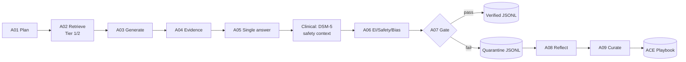

# Evidence-gated psychology MCQ pipeline

Pipeline sinh câu hỏi trắc nghiệm tâm lý có evidence gate. LangGraph điều phối
A01–A09: curriculum → retrieval → MCQ → evidence/single-answer/EI-safety judge
→ bounded regenerate on feedback → verified hoặc quarantine → ACE playbook và
judge failure memory.

Mỗi record verified bắt buộc có `evidence_refs` gồm 1–3 `chunk_id` đã retrieve;
citation nằm trong metadata/audit, không xuất hiện trong question stem hay options.
Pipeline không lưu `<think>` tự do. Trường `reasoning.steps` chỉ chứa audit steps
ngắn, có thể kiểm tra được, không phải chain-of-thought.



## Requirements

- Python 3.12 and [uv](https://docs.astral.sh/uv/).
- MongoDB collection `mental` with vector index `vector_index`.
- DSM-5 collection (default `DSM-5`) with the same vector index for clinical
  safety review.
- An OpenAI-compatible chat endpoint or a local endpoint at port `8000`.
- An embedding source: local `SentenceTransformer` or an OpenAI-compatible
  embedding endpoint.

## Setup

```bash
cd pipeline-craw-data
cp .env.example .env
uv sync
```

Edit `.env` with your MongoDB URI and model endpoint. `.env` is ignored by Git;
do not put secrets in `.env.example`.

## Run

### Default run

Uses values from `.env`, all four curriculum levels in this order:
`theory → emotion → educational_scenario → clinical_scenario`.

```bash
uv run python main.py \
  --num_qa_pairs 100 \
  --output_path data/output/psychology_mcq.jsonl
```

### Local LLM

```bash
uv run python main.py \
  --model_local \
  --model_name Qwen/Qwen3-30B-A3B-Instruct-2507 \
  --num_qa_pairs 20 \
  --output_path data/output/local_mcq.jsonl
```

`--model_local` uses `http://localhost:8000/v1`, sets a fallback API key of
`EMPTY`, and enables local embeddings unless `USE_LOCAL_EMBEDDING` is already
configured.

### Hosted or custom endpoint

```bash
uv run python main.py \
  --model_base_url https://<provider>/v1 \
  --model_name <chat-model> \
  --api_key <secret> \
  --embedding_base_url https://<provider>/v1 \
  --embedding_model <embedding-model> \
  --num_qa_pairs 20
```

Prefer configuring secrets in `.env`; `--api_key` may be visible in shell
history.

### Select curriculum types and difficulties

```bash
# Only clinical MCQs; retrieves DSM-5 safety context before A06
uv run python main.py --levels clinical_scenario --num_qa_pairs 100

# Alternate only between theory and emotion, and only generate hard questions
uv run python main.py --levels theory,emotion --difficulties hard --num_qa_pairs 100
```

Valid levels: `theory`, `emotion`, `educational_scenario`, `clinical_scenario`.
Valid difficulties: `easy`, `medium`, `hard`.

## CLI flags

| Flag | Effect |
|---|---|
| `--model_local` | Use local LLM endpoint `http://localhost:8000/v1`; enables local embedding by default. |
| `--embedding_local` | Force `USE_LOCAL_EMBEDDING=true`. |
| `--model_base_url URL` | Override `OPENAI_BASE_URL`. |
| `--model_name NAME` | Override `MODEL_NAME`. |
| `--api_key KEY` | Override `OPENAI_API_KEY`. Prefer `.env` for secrets. |
| `--embedding_model NAME` | Override `EMBEDDING_MODEL`. |
| `--embedding_base_url URL` | Override `EMBEDDING_BASE_URL`. |
| `--num_qa_pairs N` | Number of attempted MCQs. Verified count may be lower because failures go to quarantine. |
| `--output_path PATH` | Verified JSONL path. Sidecars use the same basename. |
| `--max_generation_retries N` | Retry A03 after a failed judge pass, preserving blueprint and evidence. `0` disables regeneration. |
| `--log_level LEVEL` | Console/file level: `DEBUG`, `INFO`, `WARNING`, or `ERROR`. |
| `--log_path PATH` | Override the default `<output>.run.log` log file. |
| `--output_flush_interval N` | Append JSONL checkpoints after every `N` completed items; default `5`. |
| `--levels CSV` | Comma-separated curriculum filter, e.g. `theory,emotion`. |
| `--difficulties CSV` | Comma-separated difficulty filter, e.g. `easy,hard`. |

CLI values override `.env` values for that run.

## `.env` reference

Use [`.env.example`](.env.example) as the canonical template.

| Variable | Default / example | Purpose |
|---|---|---|
| `MONGO_URI` | `mongodb+srv://...` | MongoDB connection string. |
| `MONGO_DB_NAME` | `Data` | Database containing source collections. |
| `MONGO_COLLECTION_NAME` | `mental` | Main psychology evidence collection; approved as Tier 2 after backfill. |
| `MONGO_DSM5_COLLECTION_NAME` | `DSM-5` | DSM-5 collection for clinical safety context. |
| `OPENAI_BASE_URL` | `https://api.openai.com/v1` | Chat completion endpoint. |
| `OPENAI_API_KEY` | secret / `EMPTY` for local | Endpoint credential. |
| `MODEL_NAME` | `Qwen/Qwen3-30B-A3B-Instruct-2507` | Chat model used by planner, generator, and judges. |
| `USE_LOCAL_EMBEDDING` | `true` | Use local SentenceTransformer instead of embedding API. |
| `EMBEDDING_MODEL` | `BAAI/bge-m3` | Local or remote embedding model; BGE-M3 vectors are 1024-dimensional. |
| `EMBEDDING_BASE_URL` | `http://127.0.0.1:1234/v1` | Used only when `USE_LOCAL_EMBEDDING=false`. |
| `NUM_QA_PAIRS` | `100` | Default attempt count. |
| `OUTPUT_PATH` | `data/output/psychology_mcq.jsonl` | Default verified-output path. |
| `OUTPUT_FLUSH_INTERVAL` | `5` | Persist verified/quarantine records after every five completed items. |
| `DATA_SPLIT` | `train` | Exported record split. |
| `PLAYBOOK_VERSION` | `v0.2` | Exported playbook metadata version. |
| `PLAYBOOK_REPEAT_THRESHOLD` | `3` | Repeated failures required before A09 adds a playbook bullet. |
| `MAX_GENERATION_RETRIES` | `2` | Maximum retries after the initial A03 generation. Judge feedback is injected while blueprint/evidence remain fixed. |
| `LOG_LEVEL` | `INFO` | Verbosity for structured node-step logging. |
| `LOG_PATH` | `<output>.run.log` | Optional custom log-file path. |
| `ALLOW_UNTIERED_EVIDENCE` | `true` initially | Set `false` after all main evidence has explicit Tier 1/2 metadata. |
| `DATA_DIR`, `SOURCE_TIER` | `data/formated_data`, `tier_2` | Used only by the JSON-to-Mongo import script. |
| `START_INDEX`, `END_INDEX` | `0` | Legacy-pipeline compatibility only; ignored by the new MCQ workflow. |

## Tier migration for `mental`

`mental` is a Tier 2 source. Existing chunks must carry explicit metadata before
strict evidence filtering is enabled.

```bash
# Inspect affected chunks; does not modify MongoDB
uv run python test/backfill_source_tier.py \
  --collection mental \
  --source-tier tier_2

# Persist source_tier=tier_2 after checking the dry-run count
uv run python test/backfill_source_tier.py \
  --collection mental \
  --source-tier tier_2 \
  --apply
```

Then change `.env`:

```env
ALLOW_UNTIERED_EVIDENCE=false
```

For new imports, label the complete source set explicitly:

```bash
uv run python test/import_json_to_mongodb.py \
  --data-dir data/formated_data \
  --collection mental \
  --source-tier tier_2
```

See [README_IMPORT_MONGODB.md](README_IMPORT_MONGODB.md) for more import detail.

## BGE-M3 embeddings

`BAAI/bge-m3` is the default local embedding model. Its normalized vectors are
1024-dimensional, matching the Atlas `vector_index` configuration. The model
in the attached error, `text-embedding-qwen3-embedding-0.6b`, is not a valid
public SentenceTransformers model ID; use `BAAI/bge-m3` instead.

When changing embedding models, re-embed every document. Do not mix embeddings
from different models in one collection, even if their dimensions match.

```bash
# Recompute main Tier-2 evidence vectors
uv run python test/add_embeddings.py --collection mental --overwrite

# Recompute DSM-5 vectors used by clinical A06 safety retrieval
uv run python test/add_embeddings.py --collection DSM-5 --overwrite
```

The script stores `embedding_model=BAAI/bge-m3` with each document and rejects
vectors that are not 1024-dimensional.

## Outputs and retained memory

For `data/output/psychology_mcq.jsonl`, the pipeline writes:

| File | Contents |
|---|---|
| `psychology_mcq.jsonl` | Verified training records only. |
| `psychology_mcq.quarantine.jsonl` | Rejected records and judge audit reports. |
| `psychology_mcq.playbook.md` | ACE-format playbook: section, bullet ID, helpful/harmful counts. |
| `psychology_mcq.anchors.json` | Used source chunk IDs for de-duplication. |
| `psychology_mcq.judge_failure_memory.json` | Past A04/A05/A06 failures retrieved as future judge checklists; never included in train records. |

The first run loads [`config/initial_playbook.md`](config/initial_playbook.md).
Later runs with the same output basename reload the playbook, used-anchor IDs,
and judge failure memory.

## Run logging

Every LangGraph node logs its start/end, iteration, generation attempt, evidence
count, DSM-5 safety-context count, quality verdict, retry route, and output
summary. Prompts, API keys, and full evidence excerpts are intentionally not
logged.

Verified and quarantined records are checkpointed every five completed items by
default. The final partial batch is flushed when the run ends; no previously
checkpointed record is written twice.

```bash
uv run python main.py \
  --levels clinical_scenario \
  --num_qa_pairs 10 \
  --log_level DEBUG \
  --log_path data/output/clinical_debug.log
```

## Tests

```bash
uv run python -m unittest discover -s test -p "test_*.py"
```

Tests are offline: they do not call MongoDB or an LLM endpoint.
